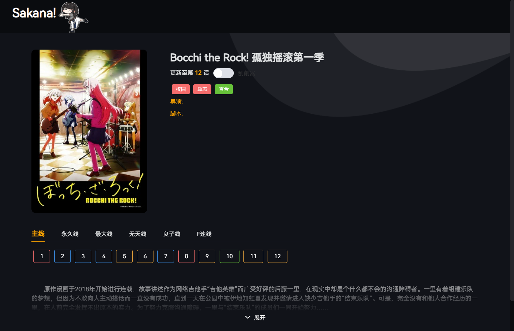

# Sakana动漫

> 使用vue + electron制作的动漫客户端。

**兴趣使然的一个项目，数据源为Age动漫和Bangumi以及必应图片。web的前端和后端都部署在vercel上，完全是0成本的，所以不会有任何广告。**

## 基本功能

新增功能展示：

https://user-images.githubusercontent.com/68995451/210163206-74d91123-65c7-4efe-a9dd-8c02d76851fb.mp4

基本功能展示：

https://user-images.githubusercontent.com/68995451/210059863-a7a7d8ce-9b25-47f7-b9c2-3f7d610ae75d.mp4

1. 查看所有动漫并进行筛选

   

2. 动漫的详情页面

   

3. 播放界面

   

4. 搜索
   
   

5. 动漫详情页升级

   

6. 开启背景图片（是不是有内味了）

   

目前算是实现一个看番软件的功能了，所以更新暂时就到这里。如果后面又想到有意思的点子的话我也会做进去的，也欢迎大家使用并提出宝贵的建议！

## 实现

见[博客：AGE动漫客户端的实现](https://blog.fullcomb.top/post/acg)。

> 另外，加载太慢的话，不妨玩玩右下角的[「石蒜模拟器」](https://github.com/itorr/sakana)。