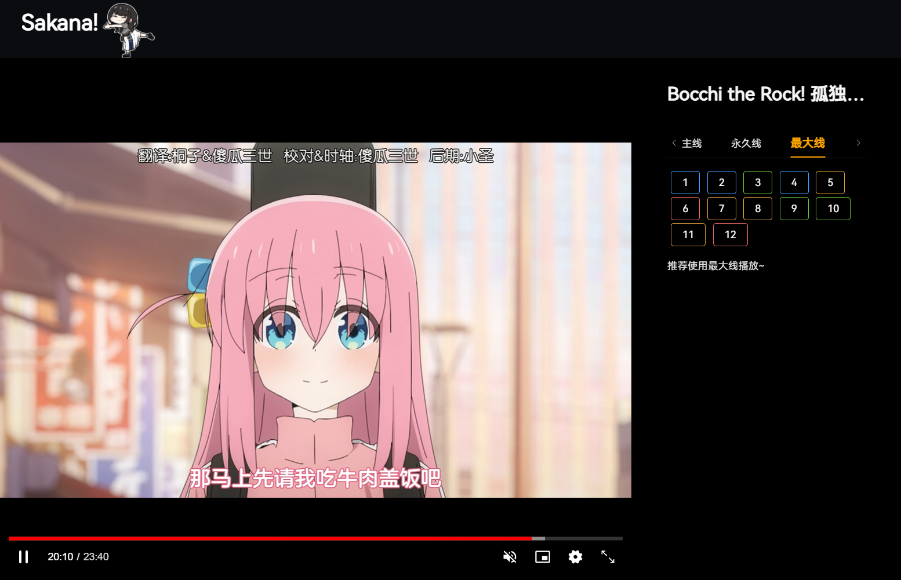

# Sakana动漫

> 使用vue + electron制作的动漫客户端。

**目前的数据源为Age动漫，仅供个人使用，一切解释权归Age动漫所有。**

## 基本功能

1. 查看所有动漫并进行筛选。

   

2. 动漫的详情页面。

   

3. 播放界面。

   

目前还有点简陋，但也可以算五脏俱全了。还有很多有趣功能就后面就边想边做了，这几天我TM拿肾肝。

## TODO

1. 搜索功能（抓包）
2. 刮削功能（类似于plex）
3. 优化优化（代码解耦和，后端可插拔）

## 实现

具体怎么实现的，之后在博客里写吧。
